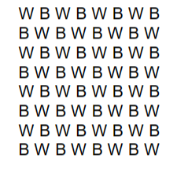
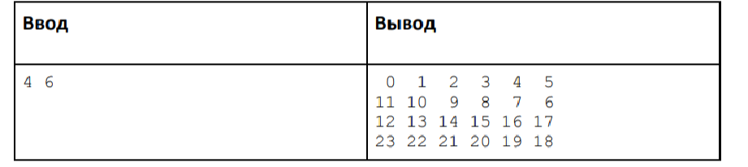

# work5

**_Задача 1:_**

1.1 Создать двумерный массив, заполнить его случайными числами.

1.2 Добавить к каждому значению число, которое пользователь будет вводить с консоли.

1.3 Найти сумму всех получившихся элементов и вывести в консоль.

**_Задача 2:_**

Создать программу для раскраски шахматной доски с помощью цикла. Создать
двумерный массив String 8х8. С помощью циклов задать элементам массива значения
B(Black) или W(White). При выводе результат работы программы должен быть следующим:

**_Задача *:_**

Даны числа n и m. Создайте массив A[n][m] и заполните его змейкой (см. пример).

Формат входных данных:
Программа получает на вход два числа n и m.

Формат выходных данных:
Программа должна вывести полученный массив, отводя на вывод каждого числа ровно 3
символа.

Пример:

